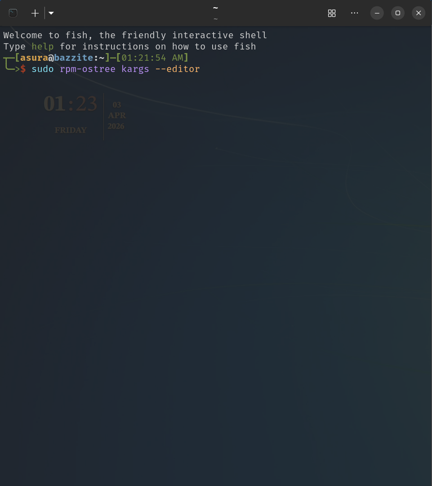
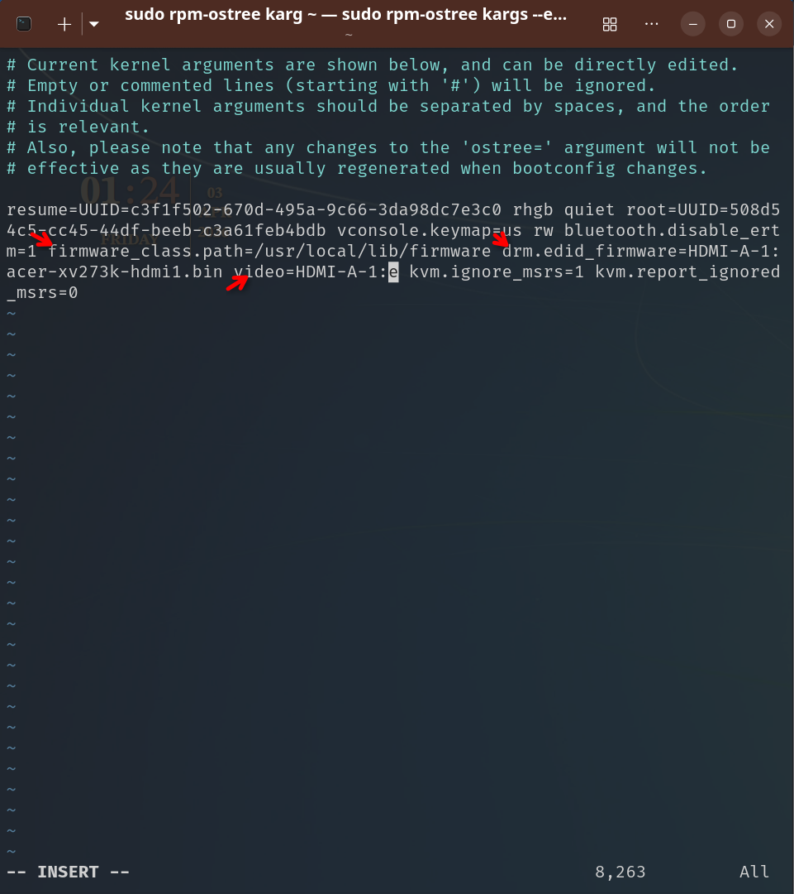
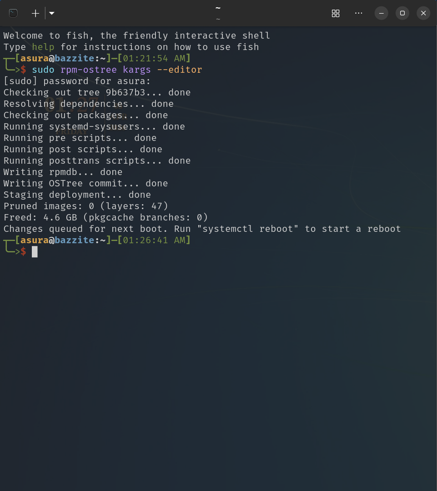

run these command on your terminal

```
sudo rpm-ostree kargs --editor
```




---
 it will open up vim.

the basic is 

- press `i` to edit something or go to insert mode
- press `esc` to go back to normal mode
- press ctrl + arrow key to navigate
- `ctrl + w` to delete faster
- `u` to undo
- and then type `:` in normal mode followed by `wq` to save and quit

this is what you need to delete 



---

and there you go done just reboot afterward



