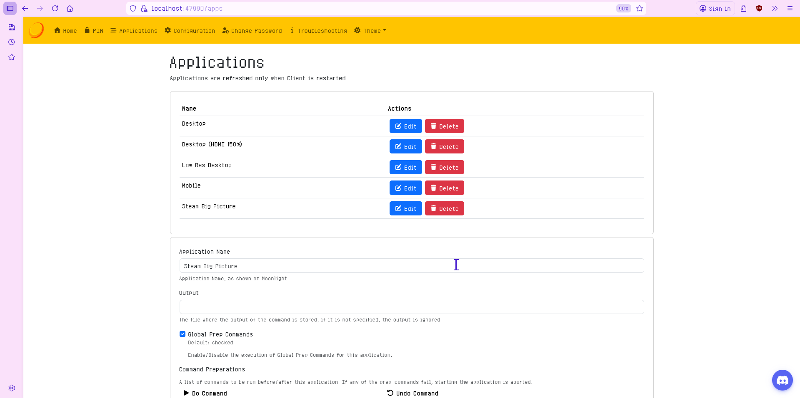
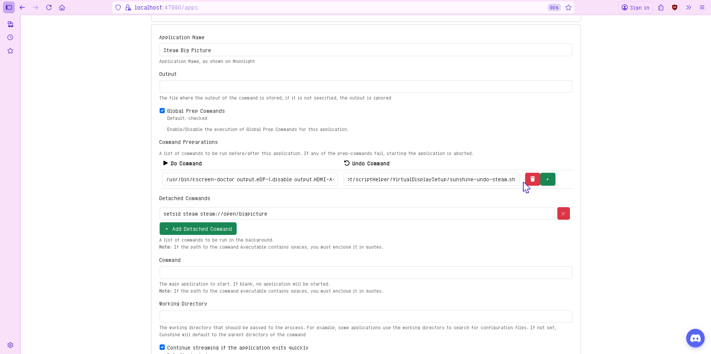

# Virtual Display Setup

Inspiration that made me do this:

```markdown
https://gist.github.com/iamthenuggetman/6d0884954653940596d463a48b2f459c
```

[Source Link](https://gist.github.com/iamthenuggetman/6d0884954653940596d463a48b2f459c)  

### Another way to create virtual Display

```markdown
https://docs.bazzite.gg/Advanced/custom_resolution/?h=custom
```

[Bazzite-custom-resolution-guide](https://docs.bazzite.gg/Advanced/custom_resolution/?h=custom)


---

## Currently Works on Bazzite with KDE (Wayland)

### Lenovo Ideapad

```
Operating System: Bazzite 43
KDE Plasma Version: 6.5.4
KDE Frameworks Version: 6.21.0
Qt Version: 6.10.1
Kernel Version: 6.17.7-ba22.fc43.x86_64 (64-bit)
Graphics Platform: Wayland
Processors: 16 × AMD Ryzen 7 5700U with Radeon Graphics
Memory: 12 GiB of RAM (9.5 GiB usable)
Graphics Processor: AMD Radeon Graphics
Manufacturer: LENOVO
Product Name: 82KU
System Version: IdeaPad 3 15ALC6
```


---

### Asus TUF

```
Operating System: Bazzite 43
KDE Plasma Version: 6.5.4
KDE Frameworks Version: 6.21.0
Qt Version: 6.10.1
Kernel Version: 6.17.7-ba22.fc43.x86_64 (64-bit)
Graphics Platform: Wayland
Processors: 12 × 11th Gen Intel® Core™ i5-11400H @ 2.70GHz
Memory: 16 GiB of RAM (15.3 GiB usable)
Graphics Processor 1: Intel® UHD Graphics
Graphics Processor 2: NVIDIA GeForce RTX 2050
Manufacturer: ASUSTeK COMPUTER INC.
Product Name: ASUS TUF Gaming F15 FX506HF_FX506HF
System Version: 1.0
```


---

## Automating Custom EDID + Virtual Display Setup (Bazzite / rpm-ostree)

You can **trivialize steps 1–5**
**by using this script:**
[VirtualDisplaySetup.sh](VirtualDisplaySetup.sh)

---

### 1. Obtain a Desired EDID Binary

Download an EDID from the LinuxTV repository:

```markdown
https://git.linuxtv.org/v4l-utils.git/tree/utils/edid-decode/data
```

[EDID Source](https://git.linuxtv.org/v4l-utils.git/tree/utils/edid-decode/data)

Pick an EDID matching your desired resolution and refresh rate.

---

### 2. Rename the EDID File

Rename the EDID file to anything ending with `.bin`, for example:

```text
edid.bin
```

> ⚠️ **Warning:**
> The filename can be anything, but you **must match it** in the kernel arguments later.

---

### 3. Install the EDID Firmware File

Create the firmware directory:

```bash
sudo mkdir -p /usr/local/lib/firmware
```

Move the EDID file:

```bash
sudo mv ./edid.bin /usr/local/lib/firmware/
```

---

### 4. Add Kernel Arguments (rpm-ostree)

Append the EDID firmware arguments:

```bash
sudo rpm-ostree kargs --append-if-missing="firmware_class.path=/usr/local/lib/firmware drm.edid_firmware=HDMI-A-1:edid.bin video=HDMI-A-1:e"
```

---

### 5. Reboot the System

```bash
systemctl reboot
```

---

### 6. Configure the Virtual Display

After logging back in:

1. Right-click the desktop
2. Open **Display Configuration**
3. You should now see an **additional display**
4. Adjust resolution / refresh rate as desired

Example:


---

## Sunshine Display Automation (Optional)

You can also **trivialize steps 7–9**
by using this script:

[SunshineConfigHelper.sh](SunshineConfigHelper.sh)

> ⚠️ **Important:**
> This configuration is **global** and applies to all Sunshine profiles.


Or automate everything with:

[AutoSunshineConfigHelper.sh](AutoSunshineConfigHelper.sh)

> ℹ️ This version is **profile-specific**


---

### 7. Identify the Virtual Display Output ID

Run:

```bash
kscreen-doctor -o | grep Output:
```

Example output:

```text
Output: HDMI-A-1
```

---

### 8. Configure Sunshine Display Switching

Start Sunshine if it is not already running.


You should see Sunshine in the system tray.


1. Right-click the **Sunshine tray icon**
   
2. Select **Open Sunshine**
   
3. Go to **Configuration → General**
   
4. Click **+ Add** to create:

   * A **Do Command**
   * An **Undo Command**

---

### 9. Sunshine Commands

#### Do Command (Streaming Start)

```bash
/usr/bin/kscreen-doctor \
  output.eDP-1.disable \
  output.HDMI-A-1.enable \
  output.HDMI-A-1.primary
```

*(Adjust output names if needed)*

---

#### Undo Command (Streaming End)

```bash
/usr/bin/kscreen-doctor \
  output.eDP-1.enable \
  output.HDMI-A-1.disable \
  output.eDP-1.primary
```

---

## Steam Big Picture Mode (Important Note)

If you are using **Steam Big Picture Mode**, Sunshine has a limitation:

* Sunshine executes **only one binary**
* Command chaining (`;`, `&&`, `sh -c`) **does not work**
* Steam Big Picture may remain open after disconnecting

### Recommended Solution: Wrapper Script

Create a script that Sunshine can execute as a single file.  
OR just use this [sunshine-undo-steam.sh](sunshine-undo-steam.sh)  

**Adjust SCript location as you please**
> This is only an example

```bash
nano ~/sunshine-undo-steam.sh
```

Paste:

```bash
#!/bin/bash

# Restore display
/usr/bin/kscreen-doctor \
  output.eDP-1.enable \
  output.HDMI-A-1.disable \
  output.eDP-1.primary

# Small delay
sleep 0.5

# Close Steam Big Picture
steam steam://close/bigpicture >/dev/null 2>&1

sleep 2

xdotool search --onlyvisible --class "steam" windowminimize

```

---

Make it executable:

```bash
chmod +x ~/sunshine-undo-steam.sh
```

Then set **Sunshine Undo Command** to:

```text
/home/USERNAME/path-to/sunshine-undo-steam.sh
```

Replace `USERNAME` with your actual username.  
Like this
```
/home/awchan/Tool/Script/scriptHelper/VirtualDisplaySetup/sunshine-undo-steam.sh
```



---

## Client Recommendation

I recommend **Artemis** (Moonlight fork) due to better features and control.

**Source:**

```markdown
https://github.com/ClassicOldSong/moonlight-android
```

[Artemis Source](https://github.com/ClassicOldSong/moonlight-android)

**Releases:**

```markdown
https://github.com/ClassicOldSong/moonlight-android/releases
```

[Artemis (Android Only)](https://github.com/ClassicOldSong/moonlight-android/releases)

---
