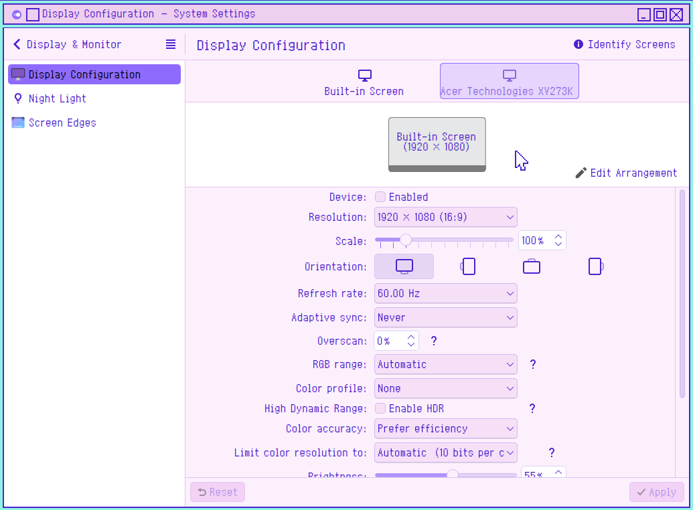
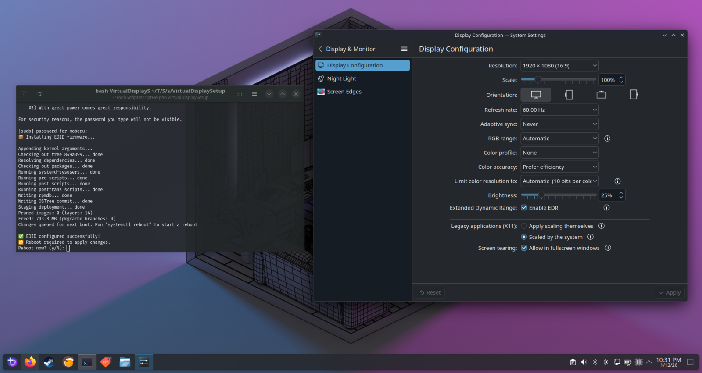
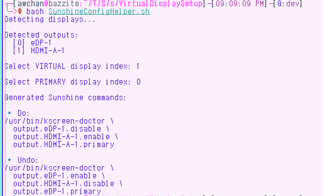
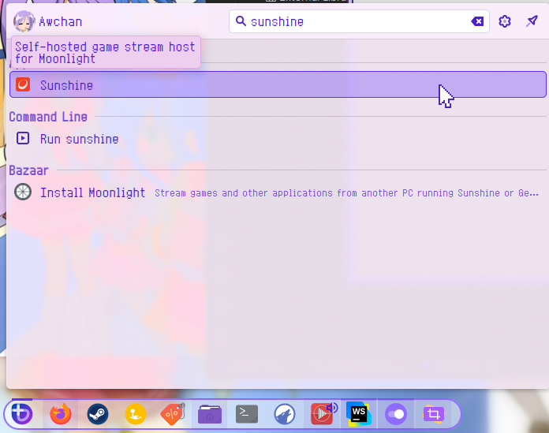
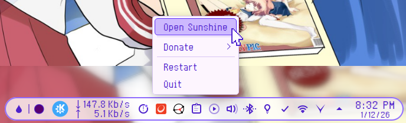
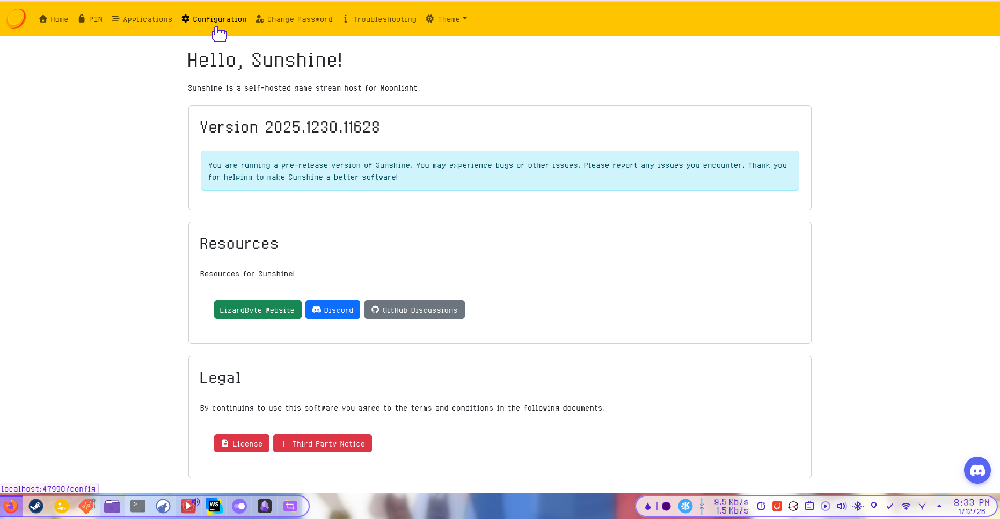
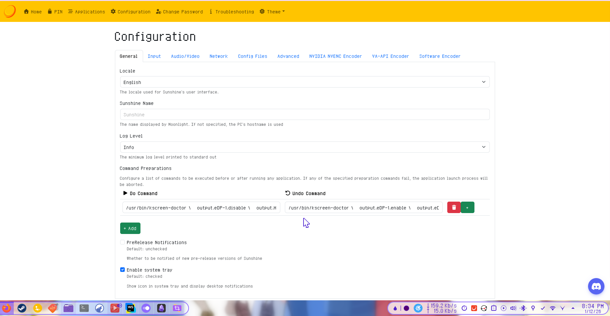

# Virtual Display Setup
 
Inpiration that made me do this :
```html
https://gist.github.com/iamthenuggetman/6d0884954653940596d463a48b2f459c
```
[Source Link](https://gist.github.com/iamthenuggetman/6d0884954653940596d463a48b2f459c)
## Currently work on Bazzite with KDE

### Lenovo Ideapad
```
Detail:
Operating System: Bazzite 43
KDE Plasma Version: 6.5.4
KDE Frameworks Version: 6.21.0
Qt Version: 6.10.1
Kernel Version: 6.17.7-ba22.fc43.x86_64 (64-bit)
Graphics Platform: Wayland
Processors: 16 × AMD Ryzen 7 5700U with Radeon Graphics
Memory: 12 GiB of RAM (9.5 GiB usable)
Graphics Processor: AMD Radeon Graphics
Manufacturer: LENOVO
Product Name: 82KU
System Version: IdeaPad 3 15ALC6
```


### Asus Tuf
```
Operating System: Bazzite 43
KDE Plasma Version: 6.5.4
KDE Frameworks Version: 6.21.0
Qt Version: 6.10.1
Kernel Version: 6.17.7-ba22.fc43.x86_64 (64-bit)
Graphics Platform: Wayland
Processors: 12 × 11th Gen Intel® Core™ i5-11400H @ 2.70GHz
Memory: 16 GiB of RAM (15.3 GiB usable)
Graphics Processor 1: Intel® UHD Graphics
Graphics Processor 2: NVIDIA GeForce RTX 2050
Manufacturer: ASUSTeK COMPUTER INC.
Product Name: ASUS TUF Gaming F15 FX506HF_FX506HF
System Version: 1.0
```


---

## Automating Custom EDID + Virtual Display Setup (Bazzite / rpm-ostree)

## You can trivialize step 1-5 
**if you decide to use this [script](VirtualDisplaySetup.sh)**

### 1. Obtain a Desired EDID Binary

Download an EDID from the LinuxTV repository:

```
https://git.linuxtv.org/v4l-utils.git/tree/utils/edid-decode/data
```
[Edid Source](https://git.linuxtv.org/v4l-utils.git/tree/utils/edid-decode/data)

Pick the EDID that matches your desired resolution and refresh rate.

---

### 2. Rename EDID 

rename EDID data as long as it end as filename.bin, then save it as(for Example):

```text
edid.bin
```

>  WARNING : the name could be whatever but you need to adjust the following command afterward

---

### 3. Install EDID Firmware File

Create the firmware directory:

```bash
sudo mkdir -p /usr/local/lib/firmware
```

Move the EDID file into it:

```bash
sudo mv ./edid.bin /usr/local/lib/firmware/
```

---

### 4. Add Kernel Arguments (rpm-ostree)

Append the EDID firmware arguments:

```bash
sudo rpm-ostree kargs --append-if-missing="firmware_class.path=/usr/local/lib/firmware drm.edid_firmware=HDMI-A-1:edid.bin video=HDMI-A-1:e"
```

---

### 5. Reboot the System

```bash
systemctl reboot
```

---

### 6. Configure the Virtual Display

After logging back into **Bazzite**:

1. Right-click on the desktop
2. Open **Display Configuration**
3. You should now see an **additional display**
4. Adjust it as you please

like this image:






---

## You can also triviliaze part 7-9

**by using this [script](SunshineConfigHelper.sh)**  
> Important : these config is global so it apply to all profile and override it 



or automate everything with this
[AutoSunshineConfigHelper.sh](AutoSunshineConfigHelper.sh)  

  
> Note: This is only for profile specific setup 

### 7. Identify the Virtual Display Output ID

Run:

```bash
kscreen-doctor -o | grep Output:
```

Look for your virtual display output ID.
Example:

```text
Output: HDMI-A-1
```

---

### 8. Configure Sunshine Display Switching

  
Just in case if it is not active, just start it

  
Then you should see it in the tray as a icon  

1. Right-click the **Sunshine tray icon** <br>
2. Select **Open Sunshine**<br>
3. Go to **Configuration → General**<br>
4. Click **+ Add** to create:

   * A **Do Command**
   * An **Undo Command**

---

### 9. Sunshine Commands

#### Do Command (Streaming Start)

Disable primary displays and enable only the virtual display:

```bash
/usr/bin/kscreen-doctor \
  output.eDP-1.disable \
  output.HDMI-A-1.enable \
  output.HDMI-A-1.primary
```

*(Adjust display IDs as needed)*

---

#### Undo Command (Streaming End)

Disable the virtual display and re-enable your primary display(s):

```bash
/usr/bin/kscreen-doctor \
  output.eDP-1.enable \
  output.HDMI-A-1.disable \
  output.eDP-1.primary
```

---

> Note: I recommend you to use Artemis as the client since it had more feature compared to regular moonlight

**Source for Artemis**
```
https://github.com/ClassicOldSong/moonlight-android
```

[Artemis Source](https://github.com/ClassicOldSong/moonlight-android)


**Direct Download Client LInk**
```
https://github.com/ClassicOldSong/moonlight-android/releases
```
[Artemis(Android Only)](https://github.com/ClassicOldSong/moonlight-android/releases)