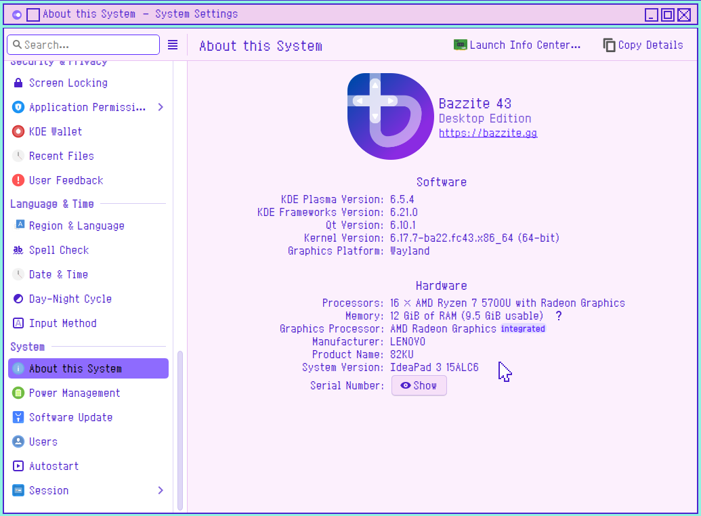
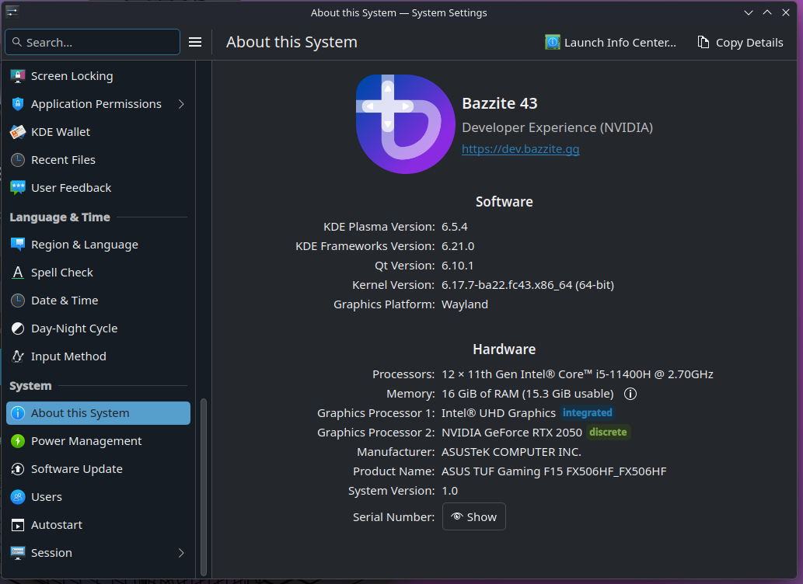
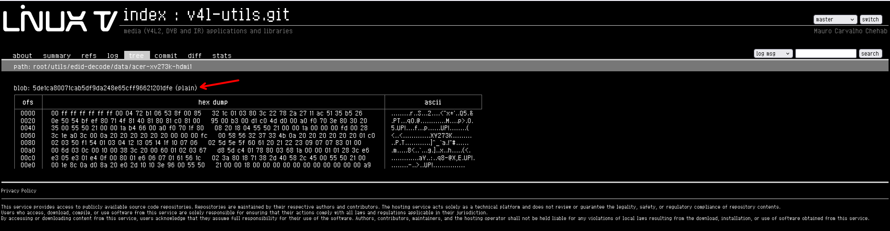
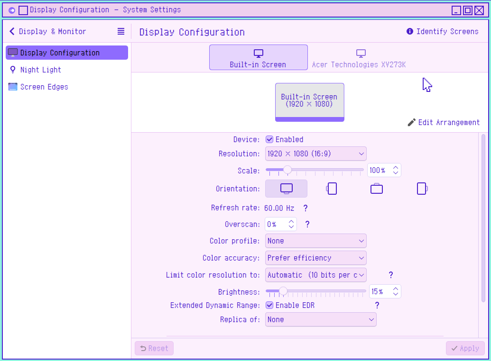
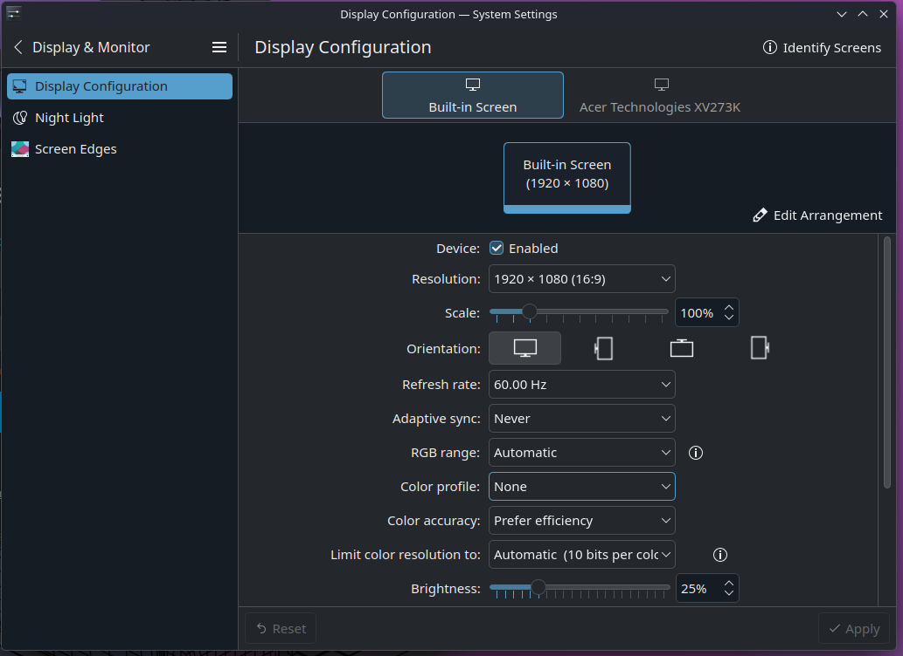
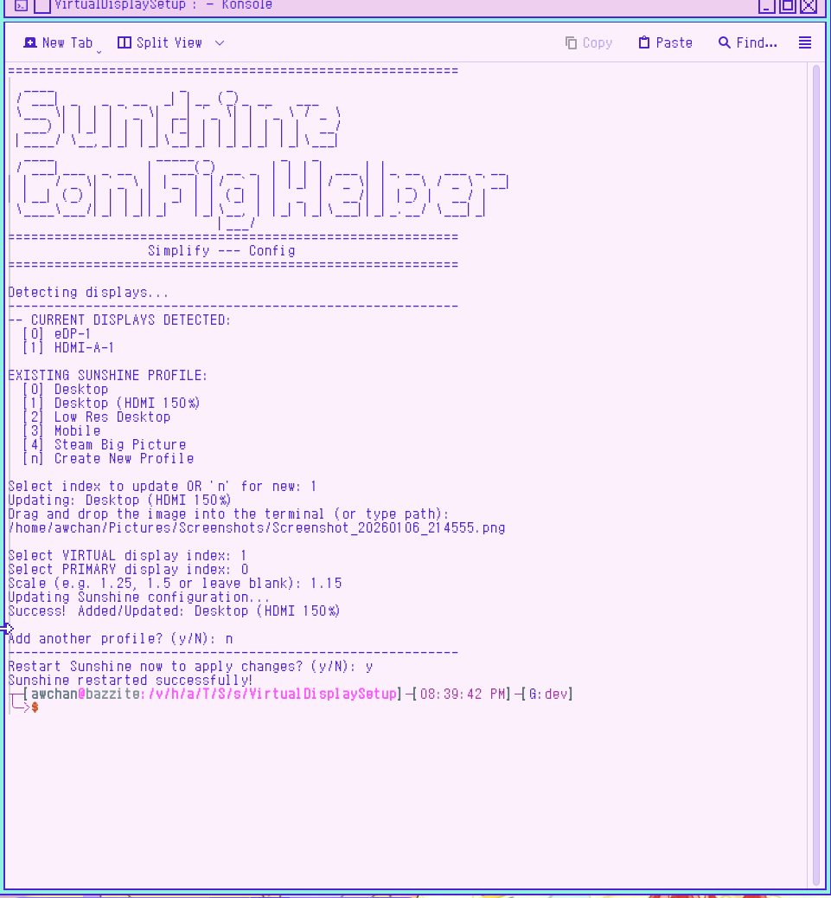

# Virtual Display Setup 

> **Important**

>**Since Sunshine is not preinstalled anymore you should read this doc to set it up first.**  
> Even if you think it is already installed just follow the instruction from there to save your time.

```
https://docs.bazzite.gg/Advanced/sunshine-brew/
```  

Inspiration that made me do this:  

```
https://gist.github.com/iamthenuggetman/6d0884954653940596d463a48b2f459c
```

[Source Link](https://gist.github.com/iamthenuggetman/6d0884954653940596d463a48b2f459c)  


### Another way to create virtual Display

```markdown
https://docs.bazzite.gg/Advanced/custom_resolution/?h=custom
```

[Bazzite-custom-resolution-guide](https://docs.bazzite.gg/Advanced/custom_resolution/?h=custom)


---

## Currently Works on Bazzite with KDE (Wayland)

### Lenovo Ideapad

```
Operating System: Bazzite 43
KDE Plasma Version: 6.5.4
KDE Frameworks Version: 6.21.0
Qt Version: 6.10.1
Kernel Version: 6.17.7-ba22.fc43.x86_64 (64-bit)
Graphics Platform: Wayland
Processors: 16 × AMD Ryzen 7 5700U with Radeon Graphics
Memory: 12 GiB of RAM (9.5 GiB usable)
Graphics Processor: AMD Radeon Graphics
Manufacturer: LENOVO
Product Name: 82KU
System Version: IdeaPad 3 15ALC6
```



---

### Asus TUF

```
Operating System: Bazzite 43
KDE Plasma Version: 6.5.4
KDE Frameworks Version: 6.21.0
Qt Version: 6.10.1
Kernel Version: 6.17.7-ba22.fc43.x86_64 (64-bit)
Graphics Platform: Wayland
Processors: 12 × 11th Gen Intel® Core™ i5-11400H @ 2.70GHz
Memory: 16 GiB of RAM (15.3 GiB usable)
Graphics Processor 1: Intel® UHD Graphics
Graphics Processor 2: NVIDIA GeForce RTX 2050
Manufacturer: ASUSTeK COMPUTER INC.
Product Name: ASUS TUF Gaming F15 FX506HF_FX506HF
System Version: 1.0
```



---

## Automating Custom EDID + Virtual Display Setup (Bazzite / rpm-ostree)

You can **trivialize steps 1–5**
**by using this script:**
[VirtualDisplaySetup.sh](VirtualDisplaySetup/VirtualDisplaySetup.sh)

---

### 1. Obtain a Desired EDID Binary

Download an EDID from the LinuxTV repository:

```markdown
https://git.linuxtv.org/v4l-utils.git/tree/utils/edid-decode/data
```

[EDID Source](https://git.linuxtv.org/v4l-utils.git/tree/utils/edid-decode/data)


> click these to download it

Pick an EDID matching your desired resolution and refresh rate.

---

### 2. Rename the EDID File

Rename the EDID file to anything ending with `.bin`, for example:

```text
edid.bin
```

> you can rename it to anything, but you **must match it** in the kernel arguments later.

---

### 3. Move the EDID File

Create the firmware directory:

```bash
sudo mkdir -p /usr/local/lib/firmware
```

Move the EDID file:

```bash
sudo mv ./edid.bin /usr/local/lib/firmware/
```

---

### 4. Add Kernel Arguments (rpm-ostree)

Check your Available Port by using this:
```
# Check Available Port
for p in /sys/class/drm/*/status; do
    con=${p%/status}
    port_name="${con#*/card?-}"
    status=$(cat "$p")
    echo "$port_name ($status)"
done
```

In my case the output is this:  
```
awchan@bazzite:/var/home/awchan$ # Check Available Port
for p in /sys/class/drm/*/status; do
    con=${p%/status}
    port_name="${con#*/card?-}"
    status=$(cat "$p")
    echo "$port_name ($status)"
done
eDP-1 (connected)
HDMI-A-1 (connected)
```


Then with that result, Append the EDID firmware arguments:  

```
sudo rpm-ostree kargs --append-if-missing="firmware_class.path=/usr/local/lib/firmware drm.edid_firmware=HDMI-A-1:edid.bin video=HDMI-A-1:e"
```

> replace `HDMI-A-1` with your available disconnected port and `edid.bin` with your actual edid file name.  
---

### 5. Reboot the System

```bash
systemctl reboot
```

---

### 6. Configure the Virtual Display

After logging back in:

1. Right-click the desktop
2. Open **Display Configuration**
3. You should now see an **additional display**
4. Adjust resolution / refresh rate as desired

Example:






---

## Sunshine Display Automation (Optional)

You can automate everything with:  

[AutoSunshineConfigHelper.sh](VirtualDisplaySetup/AutoSunshineConfigHelper.sh)

> This one is **profile-specific**  basically if you want to fine tune it to the way you like it.



---

> ** MANUAL STEP **  

### 7. Identify the Virtual Display Output ID

Well i am sure by now you should know what is your real and virtual screen for your setup already, so you can simply skip this part.  

But just to be sure that kscreen-doctor recognize your screen.  
Run:

```bash
kscreen-doctor -o | grep Output:
```

Example output:

```text
┬─[awchan@bazzite:/v/h/awchan]─[11:11:01]
╰─>$ kscreen-doctor -o | grep Output:
Output: 1 eDP-1 f75dff9f-3bba-4153-964f-ad8f038f39ee
Output: 2 HDMI-A-1 b954dc05-3187-43d2-8f17-c2ca954169a6
```

---

### 8. Configure Sunshine Display Switching

> These image is outdated and serve as reference only.

You should see Sunshine in the system tray.


1. Right-click the **Sunshine tray icon**
   
2. Select **Open Sunshine**
   
3. Go to **Configuration → General**
     
4. Click **+ Add** to create:
---

For my setup it is something like this:  

-  **Do Command**
```bash
/usr/bin/kscreen-doctor \
  output.eDP-1.disable \
  output.HDMI-A-1.enable \
  output.HDMI-A-1.primary
```
-  **Undo Command**
```bash
/usr/bin/kscreen-doctor \
  output.eDP-1.enable \
  output.HDMI-A-1.disable \
  output.eDP-1.primary
```
---

## Steam Big Picture Mode 

Create a script that Sunshine can execute as a single file.  
OR just use this [sunshine-undo-steam.sh](VirtualDisplaySetup/sunshine-undo-steam.sh)  

**Adjust script location as you please**
> This is only an example for the file name and the location feel free to put it anywhere you want.

```bash
kate ~/sunshine-undo-steam.sh
```

copy this and paste it:  

> Again you should adjust this part.
```
# Restore display
/usr/bin/kscreen-doctor \
  output.eDP-1.enable \
  output.HDMI-A-1.disable \
  output.eDP-1.primary
```

```bash
#!/bin/bash

# Restore display
/usr/bin/kscreen-doctor \
  output.eDP-1.enable \
  output.HDMI-A-1.disable \
  output.eDP-1.primary

# Small delay
sleep 0.5

# Close Steam Big Picture
steam steam://close/bigpicture >/dev/null 2>&1

sleep 2

xdotool search --onlyvisible --class "steam" windowminimize

```

---

Make it executable:

```bash
chmod +x ~/sunshine-undo-steam.sh
```

Then set **Sunshine Undo Command for Steam Big Picture** to:

```text
~/sunshine-undo-steam.sh
```


Don't mind this image, i put mine in different location.  


---

## Client Recommendation

I recommend **Artemis** (Moonlight fork) for android due to better features and control otherwise just use moonlight if you don't want to bother with it.

**Source:**

```markdown
https://github.com/ClassicOldSong/moonlight-android
```

[Artemis Source](https://github.com/ClassicOldSong/moonlight-android)

**Releases:**

```markdown
https://github.com/ClassicOldSong/moonlight-android/releases
```

[Artemis (Android Only)](https://github.com/ClassicOldSong/moonlight-android/releases)

---

## ISSUE

Shutdown from remote access would result in black screen upon booting,
to solve it set this script as undo command if you wish or put in as command on kde connect by copying the content of the script as command.  
[RS.sh](VirtualDisplaySetup/RS.sh)  
```
#!/bin/bash

/usr/bin/kscreen-doctor \
  output.eDP-1.enable \
  output.HDMI-A-1.disable \
  output.eDP-1.primary && shutdown now
```
